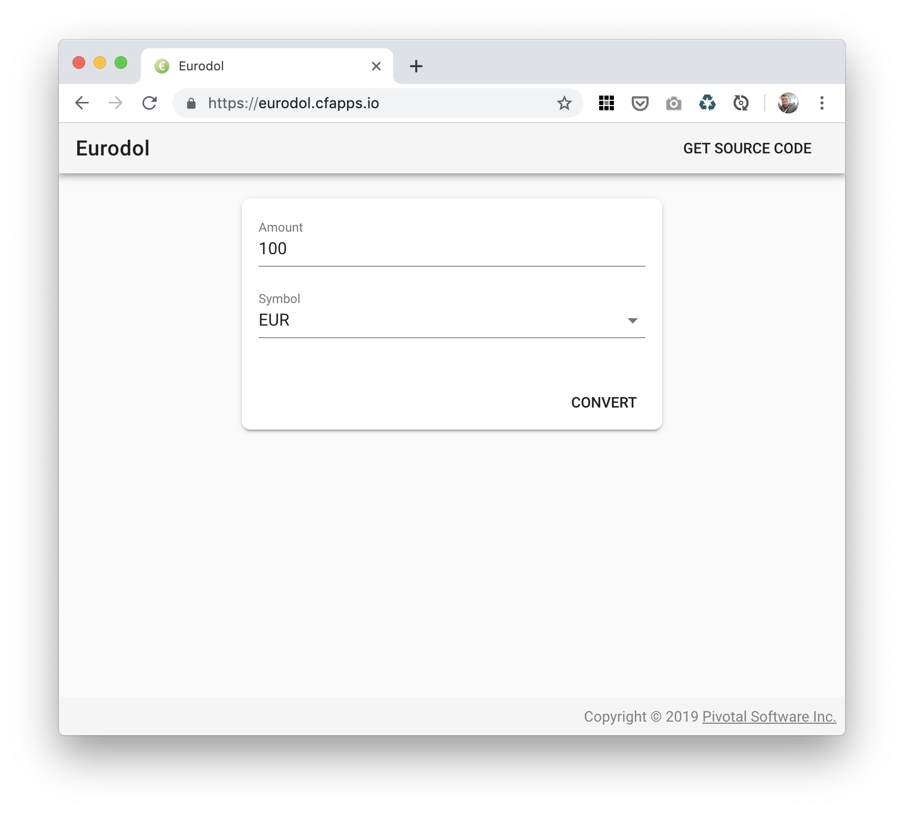
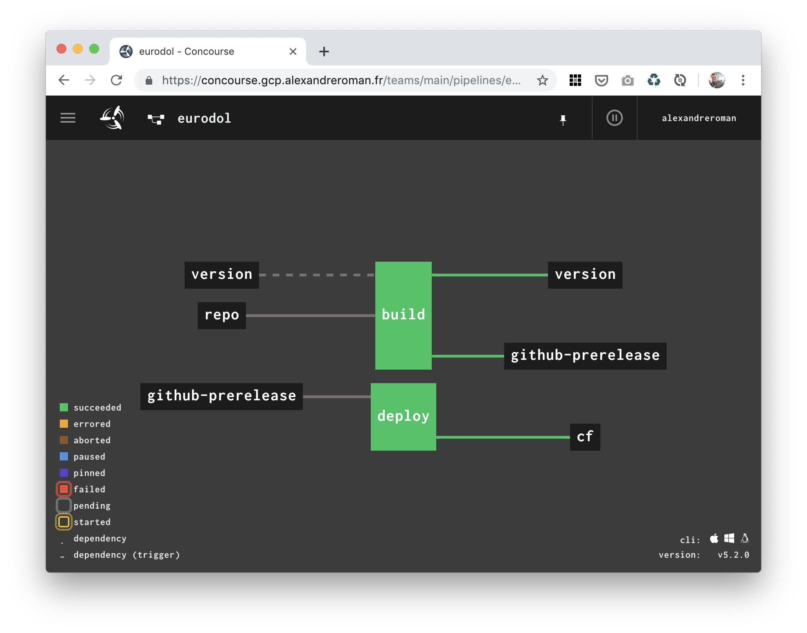

# Eurodol: a simple app to convert Euros to Dollars

This project relies on [Foreign exchange rates API](https://exchangeratesapi.io/),
a free service made by the
[European Central Bank](https://www.ecb.europa.eu/stats/policy_and_exchange_rates/euro_reference_exchange_rates/html/index.en.html)
to convert foreign currencies. Leveraging Spring Boot, Spring Cloud and Vue.js,
this app provides a simple UI to use this API in order to convert euros to
dollars with an up-to-date exchange rate.



## How to use it?

Compule this app using a JDK 8+:
```bash
$ ./mvnw clean package
```

You can run this app on your workstation:
```bash
$ java -jar target/eurodol.jar
```

The app is available at http://localhost:8080.

As soon as you hit `Convert`, a REST API call is sent to `api.exchangeratesapi.io`
to convert currencies.

## Deploy to Cloud Foundry

You can easily deploy this app to Cloud Foundry using a single command:
```bash
$ cf push
```

That's all you need to deploy this app to the Cloud!

## Using Concourse as a CI/CD pipeline

This project also includes a simple [Concourse](https://concourse-ci.org)
CI/CD pipeline to automatically build and deploy this app to your
Cloud Foundry platform:



This pipeline monitors commit from a Git repository: as soon as a new commit
is seen, a new build is created, and deployed as a GitHub (pre)release.
When a GitHub release is seen by this pipeline, the app is deployed to a
Cloud Foundry instance.

Before deploying this pipeline, you need to set some configuration values.
Start from file `ci/credentials.yml.template` to initialize these values:
```yaml
app: eurodol

git-uri: https://github.com/alexandreroman/eurodol.git
git-ci-uri: https://github.com/johndoe/myrepo.git
git-username: johndoe
git-password: accesstoken

github-owner: johndoe
github-repo: eurodol
github-access-token: accesstoken

cf-api: api.run.pivotal.io
cf-username: johndoe@pivotal.io
cf-password: secret
cf-org: org
cf-space: dev
```


## Contribute

Contributions are always welcome!

Feel free to open issues & send PR.

## License

Copyright &copy; 2019 [Pivotal Software, Inc](https://pivotal.io).

This project is licensed under the [Apache Software License version 2.0](https://www.apache.org/licenses/LICENSE-2.0).
